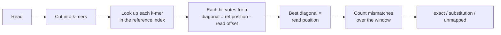

# Read mapping

Mapping answers a simple question: for each short read, where does it come from
on a longer reference sequence?

Two files are always involved. The **reference** is the long sequence you open
at start-up (a genome, a chromosome). The **reads** are the short fragments,
in a second FASTA or FASTQ file, that you want to locate on the reference.

## How SeqForge maps a read



Every read is cut into k-mers. Each k-mer is looked up in the reference index,
and each hit votes for a diagonal (the reference position minus the offset of
the k-mer inside the read). The diagonal with the most votes is where the read
aligns. The read is also mapped as its reverse complement to test the reverse
strand. Finally the mismatches are counted over the aligned window, which
separates an exact match from a read carrying a substitution or a sequencing
error.

## A worked example

The repository comes with a ready-to-run pair: a reference of 2400 bases and
four reads cut from it.

```bash
./build/seqforge demo_reference.fasta
```

At the menu, choose `-mapping`, give the reads file `demo_reads.fasta`, then a
k-mer size of `15`, then `-quit`. The output is:

```text
Mapping 4 read(s) onto a reference of 2400 bases (k = 15):

>read_exact
  position 801 (1-based), strand +, seeds 46/46, mismatches 0
  exact match (all k-mers aligned)

>read_substitution
  position 801 (1-based), strand +, seeds 31/46, mismatches 1
  aligned with 1 mismatch(es): likely substitution or sequencing error

>read_reverse
  position 1601 (1-based), strand -, seeds 46/46, mismatches 0
  exact match (all k-mers aligned)

>read_random_unmapped
  unmapped (no k-mer of the read was found in the reference)
```

## Reading the output

- **position** is the 1-based start of the read on the reference.
- **strand** is `+` for the forward strand and `-` for the reverse strand.
- **seeds x/y** is how many of the read k-mers agree on the chosen position, out
  of the total number of k-mers in the read.
- **mismatches** is the number of differing bases over the aligned window.

The substitution read is informative: it maps to the same position as the exact
read, but only 31 of its 46 seeds agree. A single substitution breaks every
k-mer that overlaps it, which is why exactly 15 seeds (the value of k) drop out.
The remaining seeds still pin the read to the right place, and the mismatch
count confirms one changed base.

The last read is random and shares no k-mer with the reference, so it is
correctly reported as unmapped. This is the expected behaviour when a read does
not come from the reference.

!!! warning "Only the first sequence is indexed"
    The reference used is the first sequence of the loaded file. If the file
    holds several sequences (for example a genome split into chromosomes), only
    the first one is indexed for now. Reads must come from that sequence to map.
